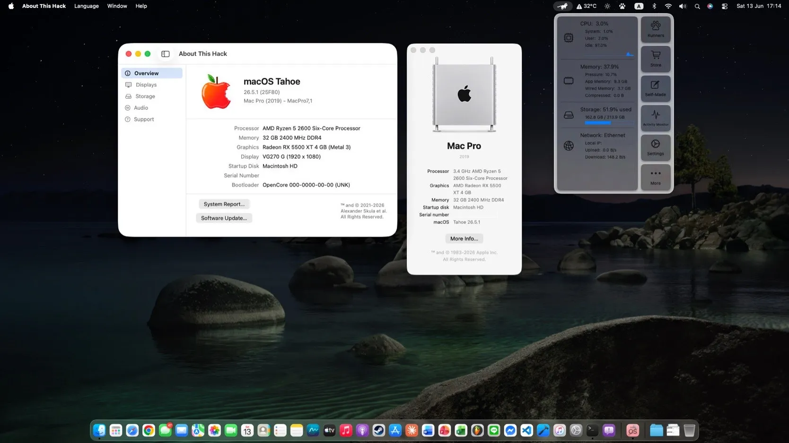

# 🍎 Ryzentosh EFI — ASRock B450M Steel Legend
### macOS Tahoe 26.5.1 | OpenCore 1.0.7

> Upgraded from macOS Sonoma 14.0.2 → Tahoe 26.5.1

---

## 💻 Specs

| Component | Detail |
|-----------|--------|
| **CPU** | AMD Ryzen 5 2600 Six-Core (Pinnacle Ridge) |
| **GPU** | AMD Radeon RX 5500 XT 4GB (Navi 14) |
| **RAM** | 32GB DDR4 2400MHz |
| **Motherboard** | ASRock B450M Steel Legend (AM4) |
| **Storage** | WD Black SN750 500GB NVMe PCIe |
| **Audio** | Realtek ALC892 + AMD Navi 10 HDMI Audio |
| **LAN** | Realtek RTL8168 PCIe Gigabit |
| **Wi-Fi / BT** | Intel Dual Band Wireless-AC 8265 (PCIe) |
| **Bootloader** | OpenCore 1.0.7 |
| **SMBIOS** | MacPro7,1 |

---

## ✅ Working

- **GPU** — Metal 3 acceleration (RX 5500 XT requires patching via OCLP-Mod 3.1.9 after install)
- **Audio** — AppleALC layout-id 1 + OCLP audio patch
- **LAN** — Realtek Gigabit 1000baseT at full speed
- **Wi-Fi** — itlwm + HeliPort (working normally)
- **Bluetooth** — Intel BT 4.2 via USB header (requires USB mapping first)
- **USB** — 15 ports mapped with USBToolBox + UTBMap
- **iCloud / App Store / iMessage / FaceTime**
- **Sleep / Wake** — works fully, wakes properly

---

## ❌ Not Working

- **Handoff / Continuity** — requires an Apple Wi-Fi card (e.g. BCM94360)
- **AirportItlwm native** — development stalled since Sonoma 14.4; tried patching for the Intel AC 8265 card but it still doesn't work, use HeliPort instead

---

## 🛠️ Main Kexts

| Kext | Version | Purpose |
|------|---------|---------|
| Lilu | 1.6.x | Base |
| VirtualSMC | 1.3.x | SMC Emulation |
| WhateverGreen | 1.6.x | GPU |
| AppleALC | 1.9.x | Audio |
| RealtekRTL8111 | 2.4.x | LAN |
| itlwm | 2.3.0 | Wi-Fi |
| IntelBluetoothFirmware | 2.4.0 | Bluetooth |
| BlueToolFixup | 0.6.x | BT Fix |
| USBToolBox + UTBMap | — | USB Mapping |
| AMFIPass | 1.4.x | OCLP Support |
| RestrictEvents | 1.1.x | CPU Name Fix |
| NVMeFix | 1.1.x | NVMe Power |

---

## ⚙️ ACPI SSDTs (from SSDTTime)

| File | Purpose |
|------|---------|
| SSDT-EC.aml | Fake EC |
| SSDT-PLUG.aml | CPU Power Management |
| SSDT-USBX.aml | USB Power Properties |
| SSDT-USB-Reset.aml | Reset USB Controllers |
| SSDT-HPET.aml | IRQ Fix |

---

## 📋 BIOS Settings

**Disable:**
- Fast Boot
- Secure Boot
- CSM
- Above 4G Decoding (if issues occur)

**Enable:**
- EHCI/XHCI Hand-off
- OS Type: Other OS

---

## 🚀 Post-Install

1. Mount the EFI partition and copy the EFI folder onto it
2. Run **OCLP-Mod 3.1.9** → Apply Root Patch (GPU + Audio)
3. Install **HeliPort** for Wi-Fi
4. Map USB ports with USBToolBox on macOS

---

## ⚠️ Notes

- **Every time macOS updates**, re-run the OCLP-Mod root patch
- **SIP** must be set to `0x803` (csr-active-config = `03080000`)
- **amfi=0x80** must always be in boot-args for OCLP to work
- This EFI works on macOS Ventura 13, Sonoma 14.0, Sonoma 14.4, Sequoia 15, and Tahoe 26.5.1 — not limited to 26.5.1

---

## 🙏 Credits

- [Dortania OpenCore Install Guide](https://dortania.github.io/OpenCore-Install-Guide/)
- [AMD-OSX](https://github.com/AMD-OSX/AMD_Vanilla)
- [OCLP-Mod (laobamac)](https://github.com/laobamac/OCLP-Mod)
- [OpenIntelWireless](https://github.com/OpenIntelWireless/itlwm)
- [USBToolBox](https://github.com/USBToolBox/tool)
